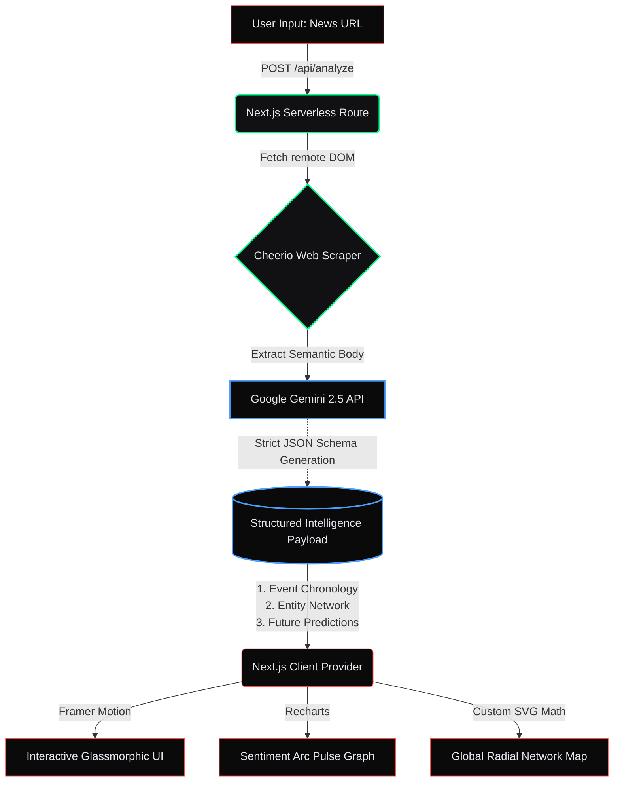

# Story Arc Tracker: Investigative Intelligence Engine

An **AI-native news intelligence dashboard** designed to transform static, one-dimensional business articles into a fully interactive, multi-dimensional investigative dossier. Built to answer the 2026 prompt: *"Business news is still delivered like it's 2005."*

## 🎯 What it is
Instead of reading thousands of words to understand a complex corporate saga, the **Story Arc Tracker** digests any news URL and instantly constructs a comprehensive visual brief. It maps out the exact timeline, flags sentiment shifts, plots key entity relationships natively, predicts future actions, and provides contrarian viewpoints.

## 🚀 Impact (The Core Value Proposition)
This engine explicitly fulfills the requirement to "make people say 'I can't go back to reading news the old way'." 

By supplying the AI with specialized analytical directives, we generate:
1. **Interactive Timelines**: Automatically breaks down narrative history.
2. **Key Players Mapped**: Discards messy graphs for a pristine, hover-reactive Global Radial Network Map showing every relationship tie.
3. **Sentiment Shifts Tracked**: Maps the emotional and operational trajectory onto an interactive Recharts pulse area graph.
4. **Contrarian Perspectives Surfaced**: Our "Devil's Advocate Protocol" explicitly identifies the opposing views and market warnings.
5. **What to Watch Next**: Our "Horizon Radar" actively predicts subsequent market or corporate moves natively derived from the generated Arc.

## 🏗 Architecture & Tech Stack
The platform is designed as a highly performant, serverless Next.js application that leverages the latest in Generative AI and fluid UI/UX design:

*   **Frontend Framework**: Next.js 15 (App Router) & React 18.
*   **Intelligence Extraction API**: Google Gemini 2.5 Flash API explicitly constrained via rigid JSON schemas to guarantee zero hallucination.
*   **Web Scraping**: Cheerio (extracting semantic HTML body text via secure serverless routes).
*   **UI/UX & Styling**: Tailwind CSS, utilizing a dark-mode "glassmorphism" aesthetic modeled after proprietary high-end analytics terminals.
*   **Animations**: Framer Motion for critical micro-interactions (e.g., Timeline card glows, hovering network node expansions).
*   **Data Visualization**: Recharts (with custom dot pings and animated tooltips) & bespoke SVG math rendering for the networking map.

## 🧩 How it Works (The Pipeline)
1. **Ingest**: User pastes a supported news URL into the command line interface.
2. **Scraping**: A Next.js serverless route fetches the HTML and strips away ads, cookie banners, and navigation, isolating the pure article body.
3. **AI Synthesis**: The raw text is passed to Gemini via a strict `SYSTEM_PROMPT`. The prompt legally forces the AI to construct an `AnalysisResult` JSON object mapping out strictly: *Events, Entities, Connections, Alternative Views, Predictions, and Sentiments.*
4. **Render**: The React UI ingests the JSON payload. Components mount with Framer Motion, and the static story is morphed into an interactive intelligence module.

## 📚 Analytical Terminology
Understanding the outputs generated by the Intelligence Engine:

### Event Pulse Tags
Every plotted event on the timeline is tagged by the AI to instantly communicate the stakes:
*   **Bullish**: Positive growth, upward momentum, optimism (e.g., "Company secures $50M Series A").
*   **Bearish**: Decline, market pessimism, extreme caution (e.g., "Quarterly earnings drop 15%").
*   **Neutral**: Purely informational context (e.g., "CEO schedules routine press conference").
*   **Critical**: High-stakes, pivotal moments that threaten the entire status quo (e.g., "SEC announces formal investigation").
*   **Controversial**: Polarizing events causing extreme market division (e.g., "Hostile takeover bid launched").

### Narrative Arc Types (The "Genre")
The overarching trajectory of the entire story is categorized into an Arc Type:
*   **Bullish Growth**: Skyrocketing trajectory; beating the odds.
*   **Crisis Spiral**: A disaster scenario where negative news continuously compounds.
*   **Cautious Recovery**: Repairing reputation or finances following heavy losses.
*   **Power Shift**: Dramatic boardroom shakeups or executive coups.
*   **Regulatory Storm**: A company forced to face heavy government action or fines.
*   **Turnaround Play**: A massive strategic pivot to save a legacy business.
*   **Stagnation**: Slow decline, flat numbers, or fading relevance.
